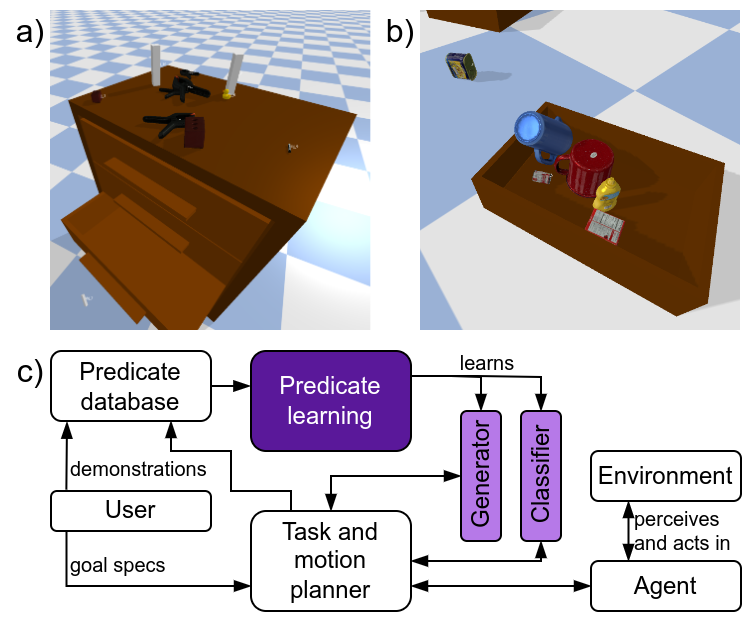

# Predicate Learning

This repository contains the code associated with our paper *"On Learning Scene-aware Generative State Abstractions for Task-level Mobile Manipulation Planning"* (link will be added as soon as it is available online).



## Installation

Install `torch`, as per the instructions on the [PyTorch website](https://pytorch.org/get-started/locally/) as well as `torch_geometric` via the [PyTorch Geometric website](https://pytorch-geometric.readthedocs.io/en/latest/install/installation.html) (use pip for this).

Create a virtual environment and install the remaining dependencies:

```bash
python3 -m venv venv
source venv/bin/activate
pip install -r requirements.txt
``` 

## Obtaining dataset

This step is optional. Instead of using our data, you can generate your own as described below.

To get you started quickly, we provide the dataset used in our paper. This includes both predicates `on_clutter` and `inside_drawer`. For each predicate, we provide:

- Demonstrations (physics simulator states)
- Extracted bounding box features
- Point clouds of single objects that can be used to train point cloud auto-encoders
- Point clouds of all objects in the demonstration scenes for encoding the scene
- Encoded point clouds for all demonstration scenes, for a range of encoder models

Furthermore, for each predicate comes with a training set of 20'000 samples, and a test set of 2'000 samples.

The data can be downloaded from the following link: *(will be added once available)*

## Usage instructions

There are two options for where to save data and models.

First, they can be stored in a directory within the repo. For this option, use the `--paths local` flag, or set `PATHS_SELECTOR = "local"` for scripts that do not parse arguments. Save the data you downloaded in the previous step into `training/predicates/data` (s.t. there is `training/predicates/data/on_clutter`, etc.) relative to this readme file.

Second, they can be stored in a data directory in your home directory. In that case, choose `--paths home` flag, or set `PATHS_SELECTOR = "home"`, and extract the data into `~/Data/highlevel_planning/predicates/data`. The paths can also be adjusted in `src/highlevel_planning_py/tools_pl/path.py` if desired.

### Prepare data

1. To generate demonstrations, use the script `scripts/data_generation/on_clutter_data_generation.py` for the `on_clutter` predicate, and `scripts/data_generation/inside_data_generation.py` for the `inside_drawer` predicate. Modify scripts to set options for data generation (# of samples, # of objects, object scales, etc.).
2. Use `scripts/predicate_learning/extract_features.py` to extract features and/or point clouds. Modify script to select which features or point clouds to extract.

### Train point cloud encoders

1. Use `scripts/predicate_learning/training_pointcloud_autoencoder.py` to train point cloud autoencoders. Use the `--help` flag to see available options.
2. Encode point clouds that were extracted in the previous step using `scripts/predicate_learning/encode_pointclouds.py`. Modify script to select which point clouds to encode, and which encoder to use.

### Train predicate models

#### Proposed method

For training models based on bound box features, use the script `scripts/predicate_learning/training_ctat_bb_features.py`. An example command would be:

```bash
python training_ctat_gnn.py --paths local --evaluate_gen --evaluate_class --predicate_name on_clutter --dataset_id 220831-175353_demonstrations_features --random_seed 12 --num_class_it 30000 --num_adversarial_it 30000 --batch_size 16 --learning_rate 0.001 --feature_version v1 --gen_loss_components disc --data_normalization_class first_arg --data_normalization_disc_gen first_arg --gen_normalize_output False --dataset_size -1 hybrid --model_version v2 --include_surrounding True --scene_encoding_dim 16 --class_encoder_type mlp --class_encoder_layers [64,32] --class_main_net_layers [64,32] --disc_encoder_type mlp --disc_encoder_layers [] --disc_main_net_layers [64,32,12] --gen_encoder_type mlp --gen_encoder_layers [64,32] --gen_main_net_layers [12,12]
```

Square brackets may need to be escaped on your shell. Use the `--help` flag to see available options.

For training models based on point cloud features, use the script `scripts/predicate_learning/training_ctat_pc_features.py`. The `--help` flag documents available options.

#### Baselines

For training decision trees, use the script `scripts/predicate_learning/training_sklearn_class.py`. The `--help` flag documents available options.

Uniform samplers do not need to be trained. Instead, only a configuration is needed that can then be [evaluated](#evaluation) directly. To create a configuration for later evaluation, use the script `scripts/predicate_learning/create_uniform_sampler_config.py`.

### Evaluation

The script `scripts/predicate_learning/evaluate.py` is used to evaluate all models and baselines, classifiers and generators, as well as bounding box and point cloud based features. To evaluate a proposed classifier, run

```bash
python evaluate.py --model gen --training_type gan --autodetect_dataset_names --filter_str 230818_100813
```

The `--training_type` flag is used to select between propsed BB or PC based methods, as well as baseline. The `--model` flag is used to select between classifier and generator. The `--filter_str` flag is used to select which models to evaluate (all runs which have the string given here as a substring in their name will be evaluated). The `--autodetect_dataset_names` flag is used to automatically detect which datasets are available for evaluation. `--dry_run` can be used to see which runs would be evaluated for a given set of arguments. Use the `--help` flag to see all available options.
